# Angular Microsfrontends

Read my other repository for concept about microfrontends [jon-grey/sample-app-module-federation-angular](https://github.com/jon-grey/sample-app-module-federation-angular)

## Try to start app locally

```sh
# by main branch is for development, by default with dynamic federation from angular
git checkout main
# switch to branch with dynamic federation with angular
# big thanks to @angular-architects/module-federation for that
git checkout dynamic_federation_from_angular
# or to static federation with webpack
git checkout static_federation_from_webpack

# angular does not support webpack 5 by default
# so we need to use yarn for building
ng config -g cli.packageManager yarn

# install dependencies
yarn

# build app
npm run build-prod

# start shell and mfe1, then open in browser at diff ports
npm run start
```

We should be capable to open `localhost:5000` and see

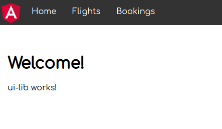

clicking on flights should load remote module from `mfe1`

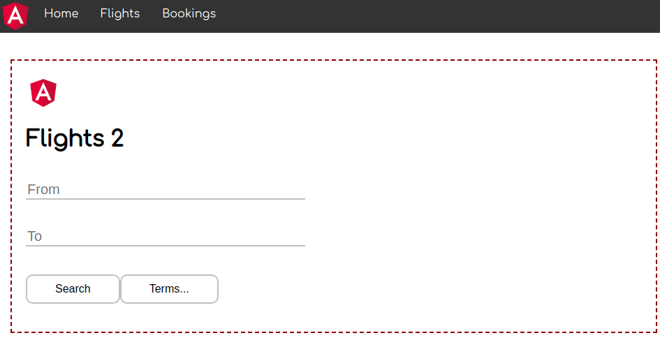

and bokings is not implemented


With `localhost:3000` we will see

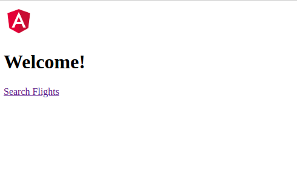

and by pressing `search flights`

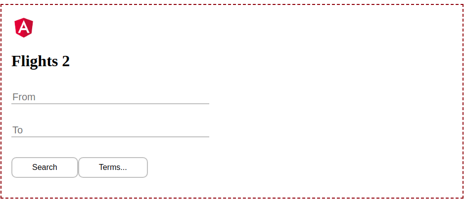

# Azure Static Web App

### Concept

From [Azure Static Web Apps – App service | Microsoft Azure](https://azure.microsoft.com/en-us/services/app-service/static/#overview)

> **Develop modern web apps fast with global reach and scale!**

> Accelerate your app development with a static front end and dynamic back end powered by serverless APIs. Experience high productivity with a tailored local development experience, GitHub native workflows to build and deploy your app, and unified hosting and management in the cloud.

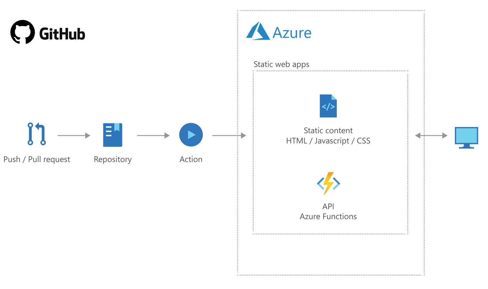

### How does it work?

- develop my app locally
- push to github
- github workflows will build it
- github workflows will ship it to Azure Web Apps, 
- use serverless backend in Azure Functions
- to access other of Azure resources.


# Setup Azure Resources

## Step 1) Create Static Web App for `shell`

At first lets create Static Web App for `shell` of our microfrontends (`mfe`).

Create new Static Web App

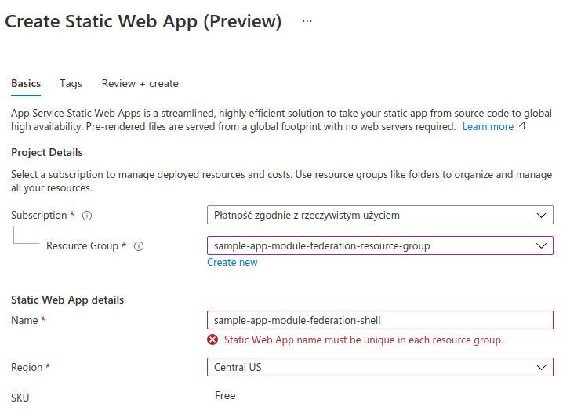

Connect to github

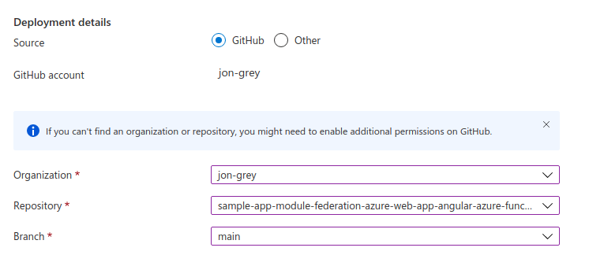

As we have web app and api in root folder

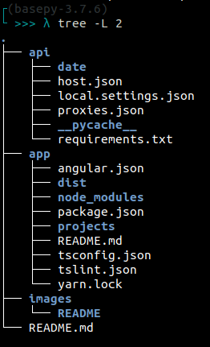

we point app location to `/app` and api to `/api`. Output location is `dist/shell`:

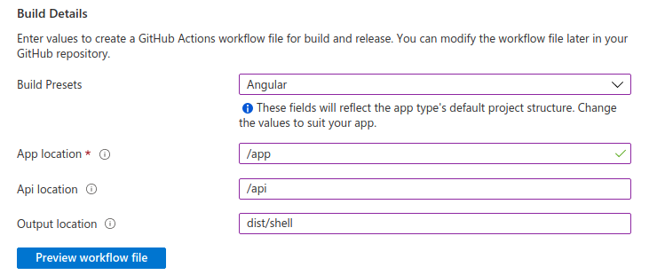

## Step 2) Create Static Web App for `mfe1`

As in Step 1) we do the same for `mfe1` microftontend. We also select the same repository to have monorepo.

...

Here we also point app location to `/app` and api to `/api` (optional). Output location is `dist/mfe1`.

## Step 3) After that we should have two static web apps


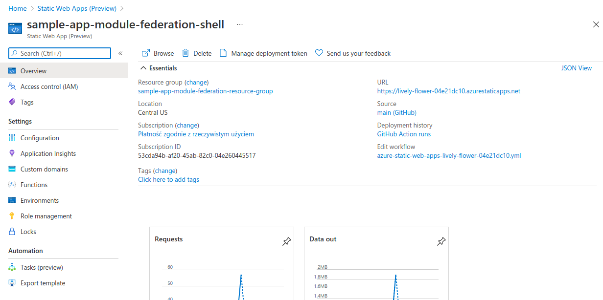

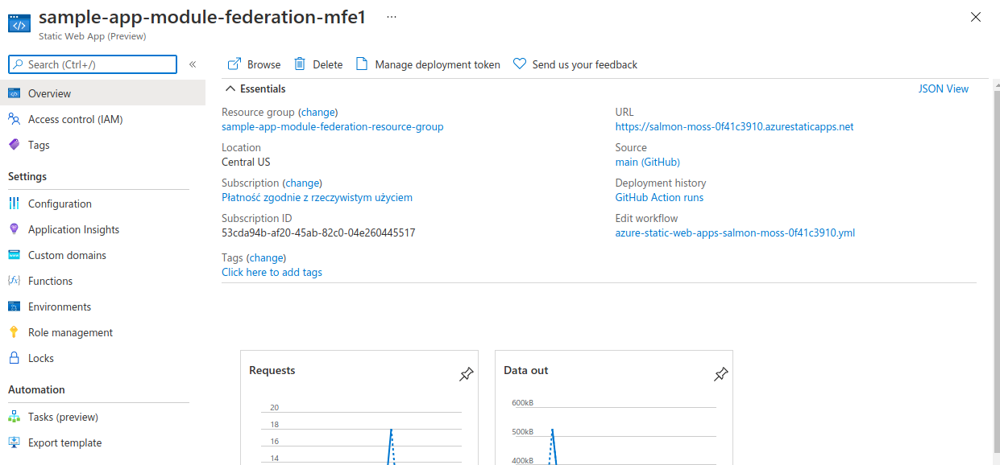

## Step 3) Manually edit github workflows for `shell` and `mfe1`

After pulling from github we should have two new yamls:


Edit them one by one to be like. First for shell:

```yaml
name: Azure Static Web Apps CI/CD - SHELL

on:
  push:
    branches:
      - main
    paths:
      - app/projects/shell
      - app/projects/ui-lib
      - app/projects/message-bus
      - app/package.json
      - app/tsconfig.json
      - app/tslint.json
      - .github/workflows/azure-static-web-apps-lively-flower-04e21dc10.yml

  pull_request:
    types: [opened, synchronize, reopened, closed]
    branches:
      - main
    paths:
      - app/projects/shell
      - app/projects/ui-lib
      - app/projects/message-bus
      - app/package.json
      - app/tsconfig.json
      - app/tslint.json
      - .github/workflows/azure-static-web-apps-lively-flower-04e21dc10.yml
      
jobs:AZURE_STATIC_WEB_APPS_API_TOKEN_LIVELY_FLOWER_04E21DC10
    if: github.event_name == 'push' || (github.event_name == 'pull_request' && github.event.action != 'closed')
    runs-on: ubuntu-latest
    name: Build and Deploy Job
    steps:
      - uses: actions/checkout@v2
        with:
          submodules: true
      - name: Build And Deploy
        id: builddeploy
        uses: Azure/static-web-apps-deploy@v0.0.1-preview
        with:
          azure_static_web_apps_api_token: ${{ secrets.AZURE_STATIC_WEB_APPS_API_TOKEN_LIVELY_FLOWER_04E21DC10 }}
          repo_token: ${{ secrets.GITHUB_TOKEN }} # Used for Github integrations (i.e. PR comments)
          action: "upload"
          ###### Repository/Build Configurations - These values can be configured to match your app requirements. ######
          # For more information regarding Static Web App workflow configurations, please visit: https://aka.ms/swaworkflowconfig
          app_location: "/app" # App source code path
          api_location: "/api" # Api source code path - optional
          output_location: "dist/shell" # Built app content directory - optional

          app_build_command: npm run build-prod:shell
          ###### End of Repository/Build Configurations ######

  close_pull_request_job:
    if: github.event_name == 'pull_request' && github.event.action == 'closed'
    runs-on: ubuntu-latest
    name: Close Pull Request Job
    steps:
      - name: Close Pull Request
        id: closepullrequest
        uses: Azure/static-web-apps-deploy@v0.0.1-preview
        with:
          azure_static_web_apps_api_token: ${{ secrets.AZURE_STATIC_WEB_APPS_API_TOKEN_LIVELY_FLOWER_04E21DC10 }}
          action: "close"
```

Here used by github, deployment token `AZURE_STATIC_WEB_APPS_API_TOKEN_LIVELY_FLOWER_04E21DC10` can be found by clicking `Manage deployment token`:


## Step 4) Push changes to github

Note: can use this hack for lazy ppl [Update github repos](#update-github-repos)

After pushing changes to github, we can go to actions and verify successful build:

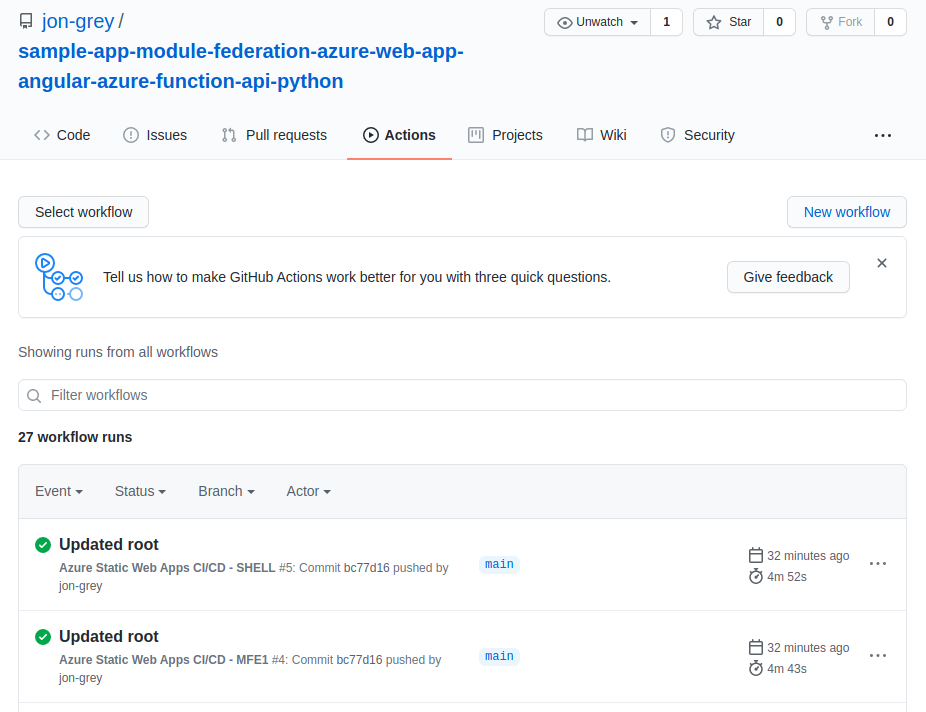

We can see that it take up to 5min. 

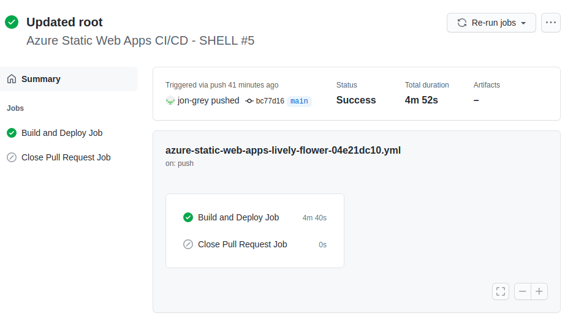

Then we can open [Shell](https://lively-flower-04e21dc10.azurestaticapps.net/) and [Mfe1](https://salmon-moss-0f41c3910.azurestaticapps.net) in the browser. Our pages should be served the same as in local development. 

Azure is using highly efficient CDN servers to serve our static files.


# Development

```sh
# angular does not support webpack 5 by default
# so we need to use yarn for building
ng config -g cli.packageManager yarn

# install dependencies
yarn

# concurrent build with watching and rebuilding on failures, plus concurent start
npm run dev
```


## Github

### Init root with submodules

```sh

( # subshell to not keep trash in bash
    set -u
    set -o pipefail

    ROOT_REPO='git@github.com:jon-grey/sample-app-module-federation-azure-web-app-angular-azure-function-api-python.git'
    APP_REPO='git@github.com:jon-grey/sample-app-module-federation-azure-web-app-angular-azure.git'
    API_REPO='git@github.com:jon-grey/sample-app-module-federation-azure-function-api-python.git'

    (
        echo "[INFO] setting up APP subrepo: ${APP_REPO}"
        cd app
        git init
        git add .
        git commit -m "first commit"
        git branch -M main
        git remote add origin ${APP_REPO}
        git push -u origin main
    )
    (    
        echo "[INFO] setting up API subrepo: ${API_REPO}"
        cd api
        git init
        git add .
        git commit -m "first commit" 
        git branch -M main
        git remote add origin ${API_REPO}
        git push -u origin main
    )
    (        
        echo "[INFO] setting up ROOT subrepo: ${ROOT_REPO}"
        git init
        echo "[INFO] setting up ROOT submodule APP: ${APP_REPO}"
        git submodule add ${APP_REPO} app 
        echo "[INFO] setting up ROOT submodule API: ${API_REPO}"
        git submodule add ${API_REPO} api 
        git add .
        git commit -m "first commit" 
        git branch -M main
        git remote add origin ${ROOT_REPO}
        git push -u origin main
    )
)

```


### Update github repos

```sh

## Update root
(
    set -e
    set -u
    set -o pipefail

    MSG="Updated readme"

    echo "[INFO] updating up ROOT repo:"
    git add .
    git commit -m "${MSG}"
    git push -u origin main
)
## Update submodule app
(
    set -e
    set -u
    set -o pipefail
    SUB="app"
    MSG="Updated ${SUB}"
    MSG="Make local libs as dependencies in package.json - build with apps."

    (
        echo "[INFO] updating up ${SUB} subrepo:"
        cd ${SUB}
        git add .
        git commit -m "${MSG}"
        git push -u origin main
    )
    (
        echo "[INFO] updating up ROOT repo:"
        git add ${SUB}
        git commit -m "Updated submodule ${SUB}"
        git push -u origin main
    )
)
## Update submodule api
(
    set -e
    set -u
    set -o pipefail    
    SUB="api"
    MSG="Updated ${SUB}"

    (
        echo "[INFO] updating up ${SUB} subrepo:"
        cd ${SUB}
        git add .
        git commit -m "${MSG}"
        git push -u origin main
    )
    (
        echo "[INFO] updating up ROOT repo:"
        git add ${SUB}
        git commit -m "Updated submodule ${SUB}"
        git push -u origin main
    )
)

```

### Useful(less) commands

```sh

# can not add submodule -> ??? already in the index
git rm -r --cached --force app
git rm -r --cached --force api

```
